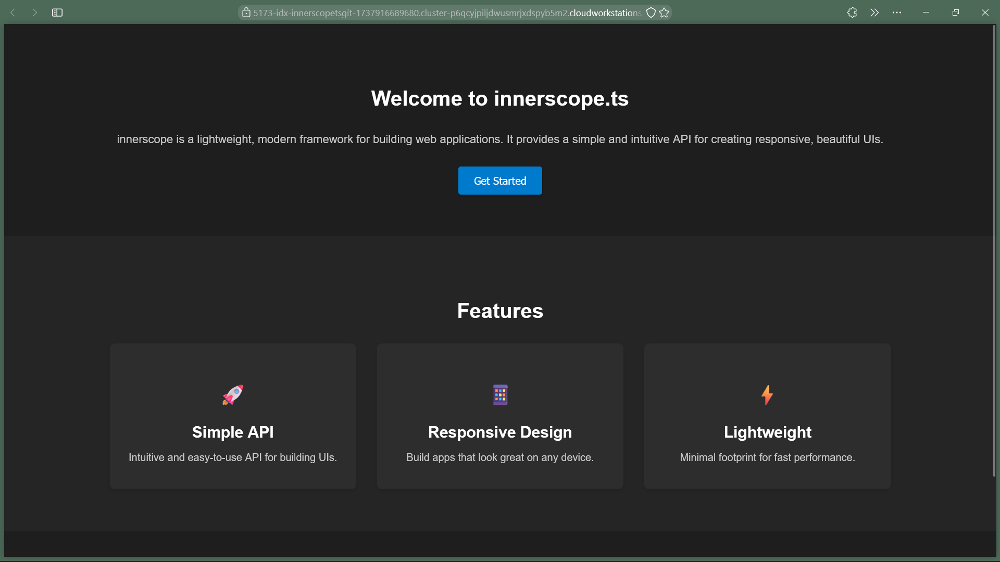

# innerscope

<br>
<div align="center">
    
    
</div>

<br>

> **innerscope** is a type-safe, high-performance framework with minimal overhead designed for building reactive  applications, whilst being easy for non-frameworkers to adopt.

## Installation

To install the framework, you can choose between npm or deno:

-   **package-managers**:

    ```bash
    npm install innerscope
    bun install innerscope
    ```

## Documentation

The documentation is evolving as the framework grows. Meanwhile, explore the provided examples and utilize LSP suggestions to get started quickly.

Here is the demo page built with innerscope, it is part of this repo in the main.ts file, however you will need to clone, install correct
dependencies and use the command `npm run dev` to get a preview: 




## Contributing

We welcome contributions to **innerscope.ds**! To contribute:

1. Fork the repository.
2. Create a new branch (`git checkout -b feature-branch`).
3. Make changes and commit (`git commit -am 'Add new feature'`).
4. Push to your fork (`git push origin feature-branch`).
5. Open a Pull Request.

Feel free to suggest new features and improvements.

## License

This project is licensed under the MIT License. 
