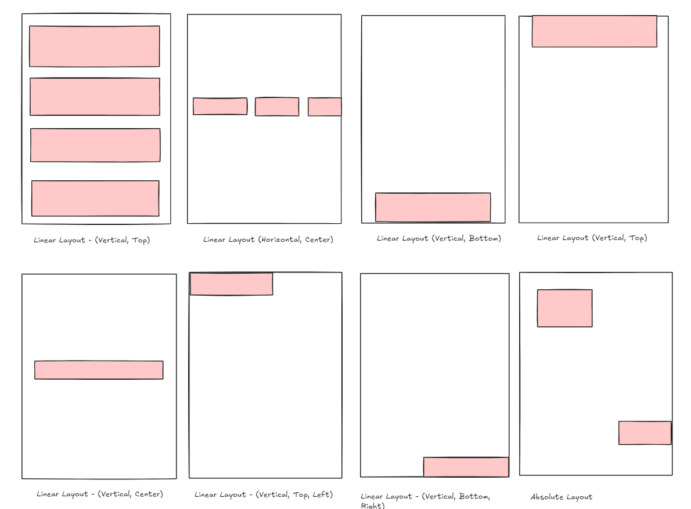

# _getting-started 🧩

<div align="center"></div>

<div align="center">


</div>

<br>

> rosana.ds has a similar syntax to react-native but without the jsx.

> make sure you have read the main README.md

## Setting up the app

To start you have to set-up at the 'App.js' file, here we declare our routing schemes and render the application, look at the 'App.js' file first.

I will explain it later, now lets start easy and small.

## Containers a.k.a a DIV

The basic starting point of a rosana.ds app is to have a container, the main container of that page must always be default exported.

The container is just a DIV, however you control the alignment of its children by adjusting the type and the childAlignmnet properties parameters.

You can refer to this image below, it is a summarized version, you can use as many combinations needed remember that:



```javascript
import { Container } from 'rosana'
let homePage = new Container(type, childAlignmentProperties);

// All Available types are :
/**
 * Linear
 * Absolute
 * Frame
 */

// All available alignment props are :
/*
   "noscrollbar",
    "scrollxy",
    "scrollx",
    "scrolly",
    "top",
    "bottom",
    "left",
    "right",
    "horizontal",
    "vertical",
    "vcenter",
    "center",
    "fillxy",
    "fillx",
    "filly",
*/

// `fillxy` is used for filling the whole page
```

